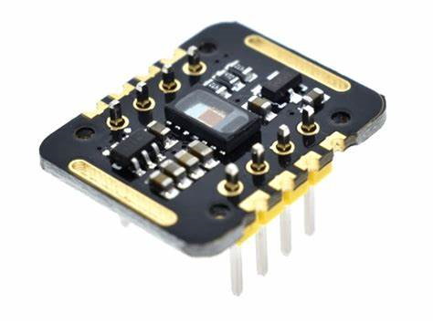

# HeartRateSPO2

#### 介绍
生命体征检测仪，温度，心率，血氧饱和度，血氧波形

#### 软件架构
下位机硬件部分：树莓派Pico 使用Arduino IDE编程
上位机软件部分：Python 使用DearpyGui框架绘制桌面客户端

#### 运行教程

1.  给单片机下载程序
2.  打开上位机软件代码，修改COM口
3.  运行上位机代码

#### 使用说明

1.  MAX30102连接单片机4，5引脚，4->SDA，5->SCL

#### 参与贡献

1.  Fork 本仓库
2.  新建 Feat_xxx 分支
3.  提交代码
4.  新建 Pull Request

#### 演示

